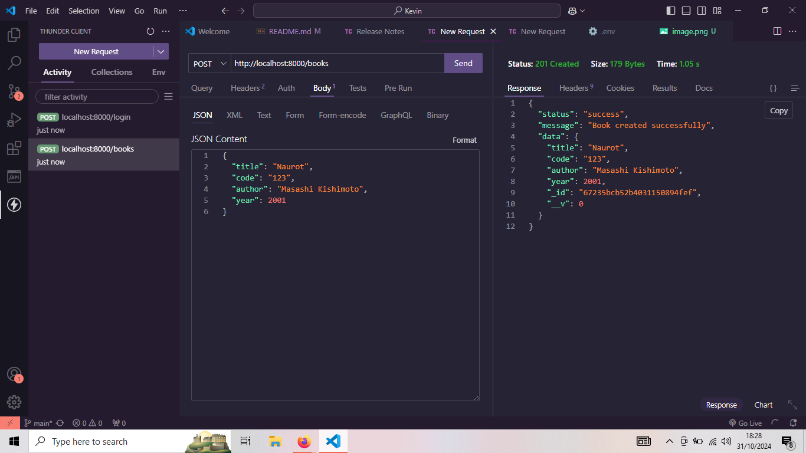

# Task 4

Restfull API Book yang dibangun menggunakan **Express.js**, **TypeScript**, dan **MongoDB** dengan **Mongoose** sebagai ODM.

## Screenshot Hasil Tugas



username = admin
password = password

## Prasyarat

Pastikan Anda telah menginstal hal berikut:
- [Node.js](https://nodejs.org/) (v14 atau lebih baru)
- [MongoDB](https://www.mongodb.com/) (jalankan lokal atau gunakan MongoDB Atlas)

## Instalasi

1. Clone repository ini ke direktori lokal Anda.

    ```bash
    git clone https://github.com/kevinmpandoh/tugas-4-productzilla.git
    cd tugas-4-productzilla
    ```

2. Install dependencies.

    ```bash
    npm install
    ```

3. Buat file `.env` di root folder proyek berdasarkan file `.env.example`.

    ```bash
    cp .env.example .env
    ```

4. Isi variabel lingkungan di `.env` sesuai konfigurasi Anda, terutama `MONGO_URI` untuk koneksi ke MongoDB.

    ```
    MONGO_URI=mongodb://localhost:27017/task-4
    PORT=8000

    USER_NAME=admin
    PASSWORD=password
    
    ```

## Jalankan Aplikasi

Setelah konfigurasi selesai, Anda bisa menjalankan aplikasi menggunakan nodemon dengan perintah berikut:

```bash
npm run dev
```

Atau untuk build dan run menggunakan TypeScript:

```bash
npm run build
npm start
```

Ini akan menjalankan server di http://localhost:8000.